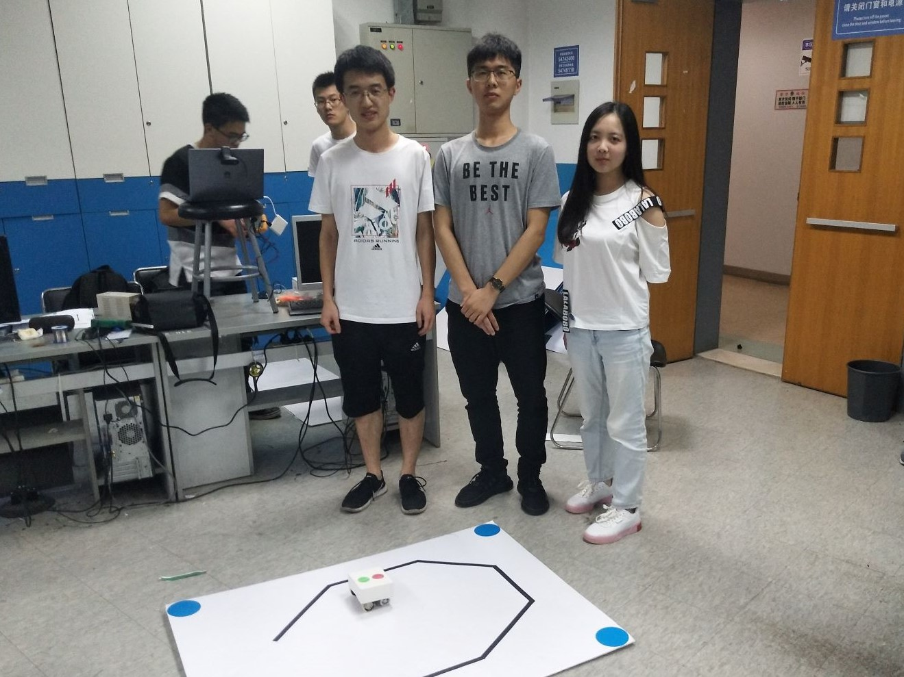
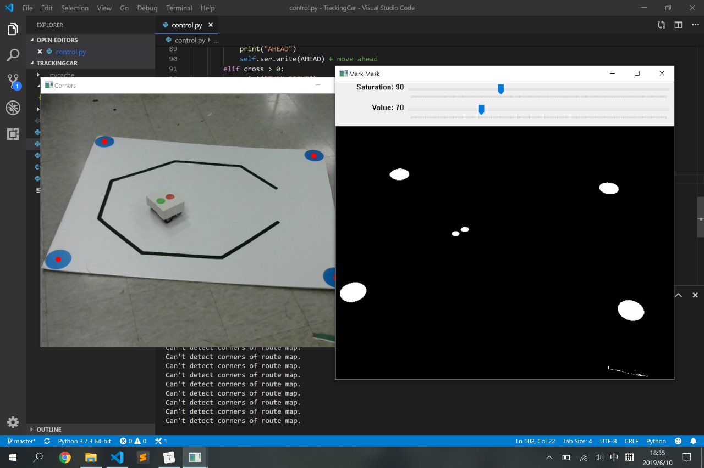
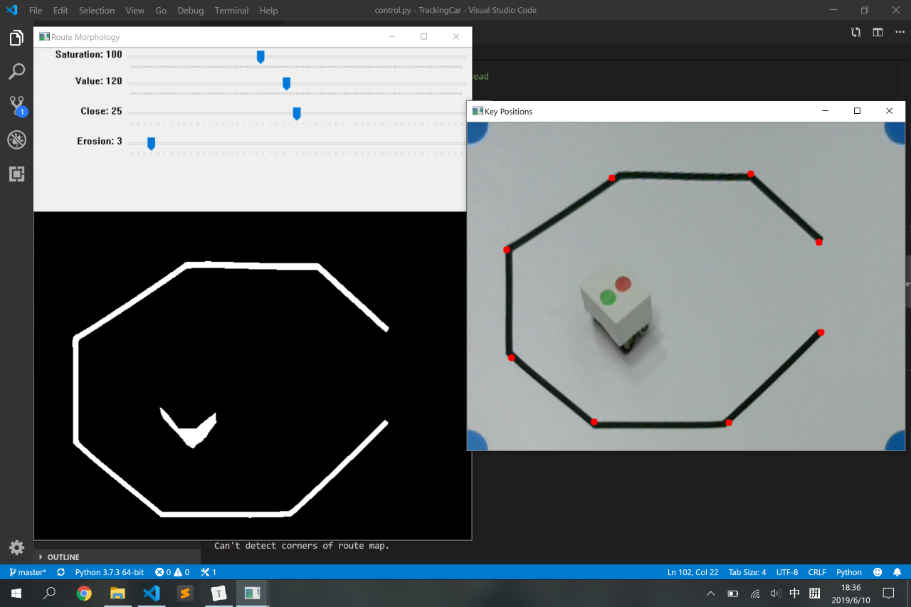
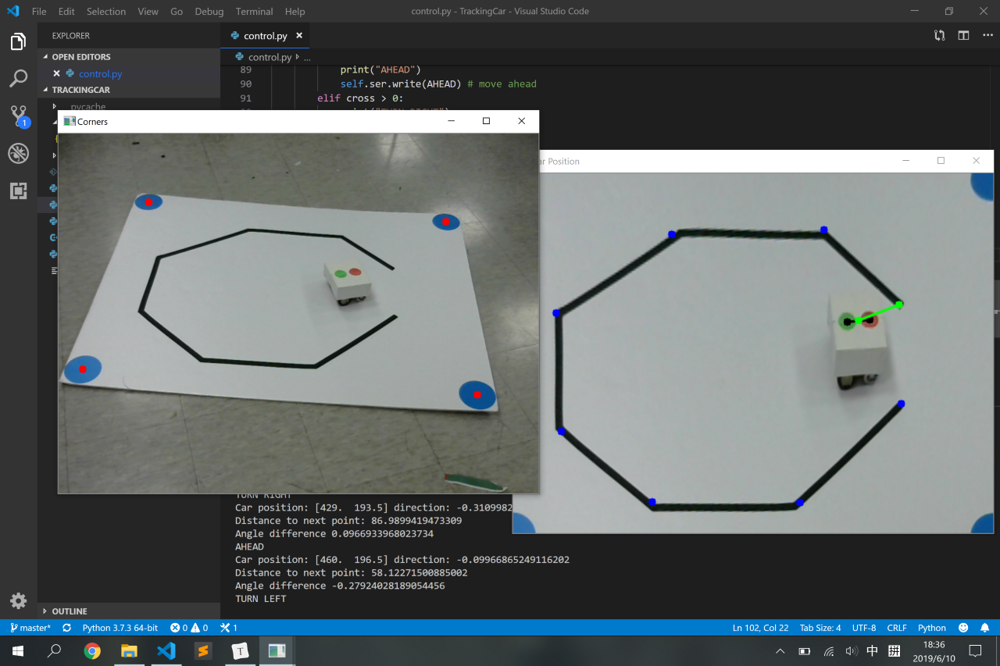
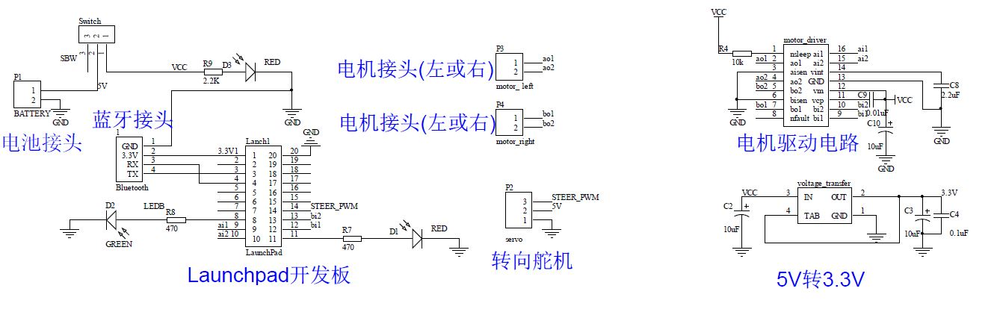

# 工程实践与科技创新 II-B 04 组项目报告

## 项目信息

### 项目名称

计算机控制小车走黑线

### 成员及分工

| 姓名     | 分工                             |
| -------- | -------------------------------- |
| 王梓涵   | 图像处理、串口通信、计算机端控制 |
| 李岩松   | 硬件处理、小车调试               |
| 杜蔻年华 | 单片机编程、小车调试             |

附工作照片：

跑道后三人为小组成员，从左自右依次为王梓涵、李岩松、杜蔻年华。

## 项目介绍

### 整体结构

整个项目由计算机、小车和跑道三个部分组成。小车置于跑道上。计算机与摄像头相连，摄像头采集图像监控小车位置。计算机通过图像处理和控制算法，对小车发出蓝牙无线控制指令。小车接受到指令后，对其进行解码，控制电机转速来响应计算机的控制指令。通过这样的方式使小车走完设定的黑线。

### 硬件部分

**MCU MSP430**	MSP430 系列单片机是一个 16 位的单片机，采用了精简指令集（RISC）结构，具有丰富的寻址方式（7 种源操作数寻址、4 种目的操作数寻址）、简洁的 27 条内核指令以及大量的模拟指令；大量的寄存器以及片内数据存储器都可参加多种运算；还有高效的查表处理指令。这些特点保证了可编制高效率的源程序。

**HC-06蓝牙模块**	蓝牙模块是指集成蓝牙功能的芯片基本电路集合，用于无线网络通讯。

先对各个针脚做初始化赋值，然后确定需要实现的函数，通过 HC-06 确定接收发送的串口信号，用模拟信号和数字信号两种赋值给管脚，实现电机转动，通过串口测试软件检测。

在本次工科创实验中的小车控制方面，我们用 M, S, A, P 分别控制小车的右转，左转，前进和停止。并且经过调整调试确定左右轮的合理转速。

### 软件部分

本组的计算机软件全部使用 Python 编写。我们充分利用了 Python 模块化和面向对象的功能，将系统的功能拆分成若干模块；在各个模块中，再将具有关联性的数据和函数封装成类。这样大大增强了代码的可读性和可维护性。

`geometry` 模块中包括了对于几何点和线段的抽象，以及距离计算的函数。对于线段类 `Line` 而言，其构造函数接受两个端点，可以计算其所在的直线参数 $\theta,\rho$ 和线段端点参数 $t_1, t_2$；`isColinear` 可以判断两个线段所在直线是否近似共线；通过 `merge` 将两个近似共线且有重合的线段归并；`otherEndpoint` 可以获得一个线段除给定端点外的另一个端点。

`route` 模块中包括了所有的图像处理程序。其包含一个 `RouteMap` 类，在构造函数中初始化视频来源。`capture` 方法主要获取新一帧的摄像头图像，探测跑道的角点，得到透视变换矩阵，对原始图像进行变换，储存变换后的跑道图像。如果是首次运行，还会弹出窗口便于摄像头和跑道位置的校准。`findRoute` 方法主要是用于抽象出路径的关键点。它首先用户给定的参数对跑道图像进行二值化和形态学变换（腐蚀+闭运算），然后使用霍夫线变换得到初始线段，并这些线段进行归并以获取主干路线。最后从图像的左上角开始，沿着已找到的线段依次搜索端点，依次加入到端点列表中，这样就得到了整个路线。`updateCar` 根据小车的头尾标记从图像中获取其位置和方向。

`control` 模块包括了控制器类 `Controller`。其构造函数接受一个 `RouteMap` 类型的路线图对象和 `Serial` 类型的串口对象。在 `run` 方法中，先调用 `RouteMap` 的 `capture` 方法进行校准并捕获初始图像，再调用 `findRoute` 获取路径点列表。在接下来的循环中，每次调用 `capture` 捕获新的图像，调用 `updateCar` 获取小车的位置和方向，计算小车当前方向的和目标方向的夹角，如果超出了阈值范围则转向，否则直行。当到达目标点时，从列表中取出下一个点，反复执行直到到达了最后一个点。

下面是软件的若干截图：

* 调整摄像头及跑道

* 提取跑道路径点

* 控制小车运行

## 运行结果

### 演示

<video src='video/demo.mp4'></video>

### 测试情况

| 项目                                   | 情况   |
| -------------------------------------- | ------ |
| 小车运行平滑流畅程度                   | 流畅   |
| 程序运行中，能否平移或旋转跑道         | 是     |
| 是否支持随机更换起点终点               | 否     |
| 是否一键启动且根据环境光强自动设置参数 | 否     |
| 跑道复杂度                             | 6 个弯 |
| 图像处理语言                           | Python |
| 是否自备小车                           | 否     |
| 小组自评                               | 2 级   |

## 总结

### 优点与不足

本项目具有下列优点：

* 系统运行稳定、流畅，小车能顺利地沿路径移动；

* 软件结构设计合理，代码可读性强，易于维护；
* 系统的可视化程度高，便于监控运行状况。

本项目尚具有下列不足：

* 受硬件条件限制，小车的行动不是十分灵活；

* 受寻路算法限制，无法做到随机更换起点终点；
* 无法根据环境光自动设置参数。

### 个人感受

> 我在本项目中主要负责了软件部分的工作，特别是图像处理这方面。程序的基本框架我很早就完成了，但是后续为了让软件具有更好的健壮性和稳定性，花了相当多时间。由于我起初是用三维软件渲染的虚拟场景做测试的，做了很多理想化的假定，结果实际测试的时候出了很多问题。之后我反复思考每一个可能出现的异常情况，比如光照变化使原先设定的阈值失效、探测不到跑道角点、提取跑道时出现多余线段等问题，不断改进程序，才有了最后的成果。这学期的项目让我对数字图像处理产生了浓厚的兴趣，我会在后续的专业课程中深入地学习这方面的知识。此次我还担任本组的组长，这个为我进一步提高组织、决策能力，并增进和班级同学的交流提供了机会。
>
> ——王梓涵

> 通过这次工科创，了解并学习关于 OpenCV 的部分相关知识，掌握了单片机的代码编写。对于一个工程项目的进行有了进一步的认识，并且对于如何进行团队合作，进度安排，调整调试有了更深的感受。虽然只是工科创 II-B，但在过程中还是遇到了不少问题。希望在 III-C 中继续学习，不断进步。
>
> ——李岩松

> 本次工科创2B实践中，我负责的是小车控制的单片机编程部分。小车控制的实现逻辑比较简单，但是硬件本身存在的问题常常是偶然不可知，出现了电机不平衡，阻矩大，前后轮抓地力弱，甚至电机导线脱落等问题，比较繁琐反复，在调试硬件的过程中，要非常感谢队友们，为改善硬件提供了很多帮助。此外，图像处理，路线生成，串口控制，调试时的参数调整等，负责的同学也都为我们进行了详细的讲解，让我们对整个项目框架和实现逻辑有比较清晰的了解，也学习了 OpenCV 的相关知识。可以说，本次实践让我感受最深的是团队合作的魅力，队友们、老师、助教的帮助，为我们项目的成功提供了强劲的助力。此外，繁琐的参数和硬件调试也锻炼了我们冷静思考的能力。
>
> ——杜蔻年华

## 附录

### 系统使用说明

1. 确保计算机上安装了 Python 3.x 版本解释器，并安装了 `numpy`、`opencv-python` 以及 `pyserial` 三个包。
2. 打开小车电源，将计算机和小车通过蓝牙连接。
3. 运行 `control.py`（可通过命令行 `python control.py` 或 IDE 内的启动按钮执行）程序会对小车先发出一段测试指令。（具体为：停止-前进-左转-前进-右转-前进-停止）
4. 屏幕上出现两个图像窗口。将小车放在跑道的任意不遮挡跑道的位置，调整摄像头和跑道位置，使得跑道完全出现在 Corners （角点）窗口内。调整 Mark Mask （标记遮罩）窗口中的 Saturation（饱和度）和 Value（亮度）滑块，使得角点圆形标记的二值化图像清晰可见，且左侧图像中且四个角点处各出现一个红色点。确定后按回车键。
5. 屏幕上出现两个图像窗口。调整 Route Morphology（路线形态学）窗口中的 Saturation（饱和度）、Value（亮度）、Close（闭运算）和 Erosion（腐蚀）滑块，使得路线的二值化图像清晰、完整（小车的阴影可能也会出现，不过影响不大），且 Key Positions（关键位置）窗口中显示的关键点符合预期。确定后按回车键。
6. 小车开始运动，屏幕上出现两个图像窗口。Car Position（小车位置）窗口内用黑点标记出小车的首尾标记位置，用绿色线段标记小车位置和目标位置的连线（线段两端有绿点），用蓝点标记剩余的路径点位置。如果要在运行时调整摄像头或跑道位置，注意 Corners（角点）窗口中是否四个角点都能辨认，否则系统会暂停运行。
7. 小车走完跑道会停止，程序会自动退出。

### 源代码

所有源代码均放在 [`source`](source) 目录内。

计算机端软件源码见 [`geometry.py`](source/geometry.py)、[`route.py`](source/route.py)、[`control.py`](source/control.py) 三个文件，单片机端代码见 [`oncar.ino`](source/oncar.ino)，必要之处已给出注释。

### 系统电路图

### 参考资料

1. [OpenCV-Python Tutorials](https://docs.opencv.org/4.1.0/d6/d00/tutorial_py_root.html)
2. 工程实践与科技创新 2-B 指导书